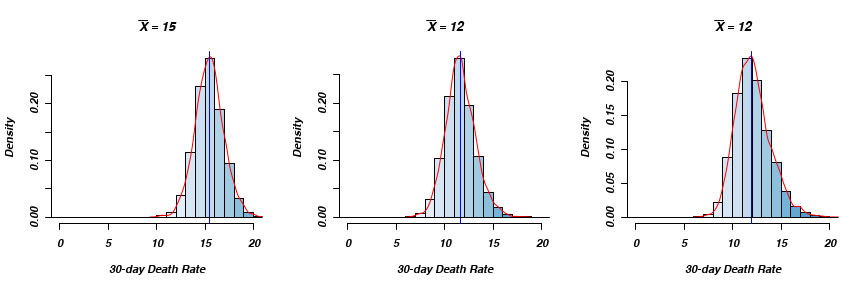
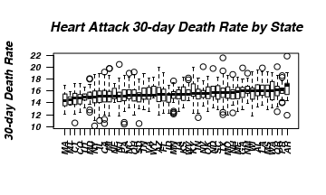
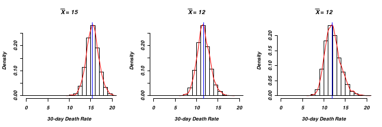

This is a Reproducable researche Rmarkdow example: Mortalty in USA Hospitals
========================================================

**Abstract**

__Objective__
Create a reproducable research article with Rmarkdown and share it.  

__Methods__
I will be using data from [Medicare](http://hospitalcompare.hhs.gov) which contains two datasets

1. This table provides general Hospital information in response to a Hospital Compare search.
2. The Outcome of Care Measures nationwide (USA).

The codebook is provided and will be avalable as supplimentary file. 
I will be using Knitr (<a href="http://yihui.name/knitr/">Andrew et al. 2013</a>) for Rmarkdown compilation.

__Results__

__Conlutions__

Introduction
------------

Material and methods
------------
This is the first table __Table__ 1.

Results
------------
See next Figure 1.

<figure><figcaption>Figure 1: A histogram and density estimates for three outcomes.</figcaption></figure>

As you can deduce from the Figure 2.

<figure><figcaption>Figure 2: A boxplot of median moratlity accross the regeons.</figcaption></figure>

There is previous image here Figure 2.

And yet another image Figure 3.
<figure><figcaption>Figure 3: A scatterplot of death rate by number of the patients and hospital owner.</figcaption></figure>

Discussion
------------

Supplimentary files
------------
Data files and codebooe are avalable [here](https://dl.dropboxusercontent.com/u/530192/public_data/DataMedicareMeasuresHospitals.zip).

