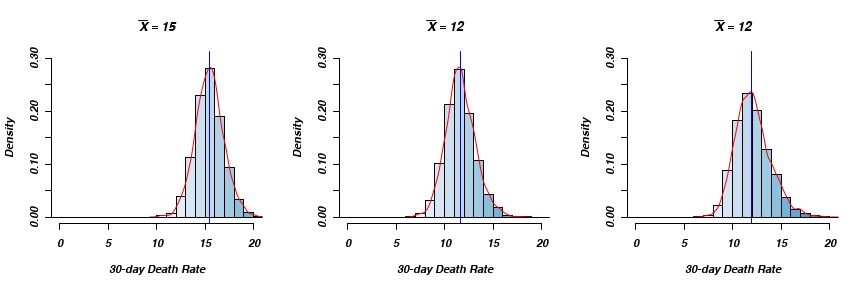
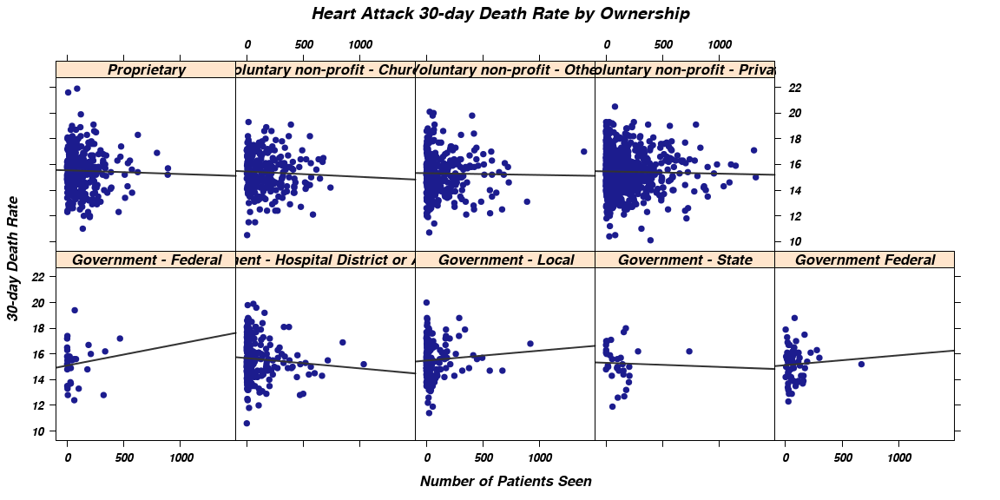

This is a Reproducable researche Rmarkdow example: Mortalty in USA Hospitals
========================================================


**Abstract**


__Objective__
Create a reproducable research article with Rmarkdown and share it.  

__Methods__
I will be using data from [Medicare](http://hospitalcompare.hhs.gov) which contains two datasets


1. This table provides general Hospital information in response to a Hospital Compare search.
2. The Outcome of Care Measures nationwide (USA).


The codebook is provided and will be avalable as supplimentary file. 
I will be using Knitr (<a href="http://yihui.name/knitr/">Andrew et al. 2013</a>) for Rmarkdown compilation.

__Results__


__Conlutions__

Introduction
------------


Material and methods
------------
This is the first table __Table__ 1.


Results
------------
See next Figure 1.


```r
cols <- brewer.pal(9,"Blues")
pal <- colorRampPalette(cols)
par(mfrow=c(1,3))
hist(outcome[,11],xlab="30-day Death Rate",
     main=substitute(bar(X)==k,list(k=mean(outcome[,11],na.rm=TRUE))),
     xlim=c(0,20),ylim=c(0,0.3),prob=TRUE,col=pal(20))
lines(density(outcome[,11],na.rm=TRUE),col="red")             # add a density estimate with defaults
abline(v=median(outcome[,11],na.rm=TRUE),col="blue")
abline(h=0)
hist(outcome[,17],xlab="30-day Death Rate",
     main=substitute(bar(X)==k,list(k=mean(outcome[,17],na.rm=TRUE))),
     xlim=c(0,20),ylim=c(0,0.3),prob=TRUE,col=pal(20))
lines(density(outcome[,17],na.rm=TRUE),col="red") 
abline(v=median(outcome[,17],na.rm=TRUE),col="blue")
abline(h=0)
hist(outcome[,23],xlab="30-day Death Rate",
     main=substitute(bar(X)==k,list(k=mean(outcome[,23],na.rm=TRUE))),
     xlim=c(0,20),ylim=c(0,0.3),prob=TRUE,col=pal(20))
lines(density(outcome[,23],na.rm=TRUE),col="red") 
abline(v=median(outcome[,23],na.rm=TRUE),col="blue")
abline(h=0)
```

<figure><figcaption>Figure 1: A histogram and density estimates for three outcomes.</figcaption></figure>


As you can deduce from the Figure 2.


```r
outcome2 <- outcome[!(outcome$State %in% names(table(outcome$State)[table(outcome$State)<20])),]
death <- outcome2[, 11]
state <- outcome2$State
par(las=2,cex.axis=0.8)
state.median<-reorder(state,death, na.rm=T,median)
par(las=2,cex.axis=0.8)
state.median<-reorder(state,death, na.rm=T,median)
boxplot(death ~ state.median,ylab="30-day Death Rate",main="Heart Attack 30-day Death Rate by State",xaxt="n")
labs <- paste0(names(table(state.median)),"(",as.numeric(table(state.median)),")")
axis(side=1,at=1:length(levels(state.median)),lab=FALSE)
text(1:length(levels(state.median)),par("usr")[3] - 1.5,srt=90, labels=labs, xpd=T, cex=0.7)
```

<figure><figcaption>Figure 2: A boxplot of median moratlity accross the regeons.</figcaption></figure>


There is previous image here Figure 2.


And yet another image Figure 3.

```r
xyplot(death~npatient|owner,
panel=function(x,y,...){
  panel.xyplot(x,y,...)
	panel.lmline(x,y,...)
},
xlab="Number of Patients Seen",ylab="30-day Death Rate",
main="Heart Attack 30-day Death Rate by Ownership")
```

<figure><figcaption>Figure 3: A scatterplot of death rate by number of the patients and hospital owner.</figcaption></figure>


Discussion
------------


Supplimentary files
------------
Data files and codebooe are avalable [here](https://dl.dropboxusercontent.com/u/530192/public_data/DataMedicareMeasuresHospitals.zip).


